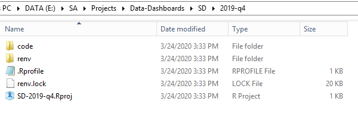

# lictemplate

An R package that provides template workflows for license data preparation and dashboard production. These templates make use of several other SA-built R packages: [salic](https://southwick-associates.github.io/salic/), [salicprep](https://github.com/southwick-associates/salicprep), [workflow](https://github.com/southwick-associates/workflow),
[sadash](https://github.com/southwick-associates/sadash).

## Installation

From the R console:

```r
install.packages("remotes")
remotes::install_github("southwick-associates/lictemplate")
```
    
## Usage

Lictemplate provides functions to automate license data workflows:

- **Initialize new projects**: 
    + `new_project()` for a basic processing workflow (e.g., national/regional dashboards)
    + TODO: `new_project_summary()` for states that provide summarized data for national/regional dashboards
    + `new_project_individual()` for the more involved individual state dashboards
- **Update existing projects:**
    + `update_project()` to copy the workflow from an earlier time period with updated parameters
    + `setup_data_dive()` to add code neeeded for a data dive project
    + TODO: `archive_data()` and `destroy_data()` to manage license data

### Example New Project

To begin a new project, first create data directories and template files for analysis. For example, creating a South Dakota dashboard project on the server:

```r
lictemplate::new_project("SD", "2019-q4")
## A new license data project has been initialized:
##  E:/SA/Projects/Data-Dashboards/SD/2019-q4
```



Next, open the Rstudio project just created and build the project package library with [package renv](https://rstudio.github.io/renv/index.html):

```r
renv::restore()
```

See [package salicprep](https://github.com/southwick-associates/salicprep) for data processing guidelines.
