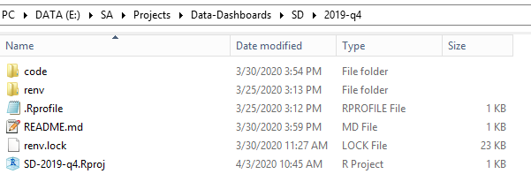

# lictemplate

An R package that provides template workflows for license data preparation and dashboard production. The workflows make use of several other SA-built R packages: [salic](https://southwick-associates.github.io/salic/), [salicprep](https://github.com/southwick-associates/salicprep), [workflow](https://github.com/southwick-associates/workflow),
[sadash](https://github.com/southwick-associates/sadash).

## Installation

From the R console:

```r
install.packages("remotes")
remotes::install_github("southwick-associates/lictemplate")
```
    
## Usage

The package includes several functions for automating the production of template workflows:

- **initializating new projects**: 
    + `new_project()` for basic processing (e.g., national/regional dashboards)
    + TODO: `new_project_summary()` for states that provide summarized data for national/regional dashboard
    + `new_project_individual()` for more involved individual state dashboards
- **updating existing projects:**
    + `update_project()` to copy the workflow from an earlier time period
    + `setup_data_dive()` to add the workflow necessary for producing a data dive project (sometimes included as part of individual state dashboards)
- TODO (maybe): `archive_raw_data()` to move raw data to the archive H drive on the data server.

### Example New Project

First populate a directory with template files. This creates data directories and a set of template files/folders for analysis, defaulting to Data Server file paths:

```r
# example for South Dakota 2019 end-of-year dashboard
lictemplate::new_project("SD", "2019-q4")
## A new license data project has been initialized:
##  E:/SA/Projects/Data-Dashboards/SD/2019-q4
```



Next, open the Rstudio project just created and build the project package library with [package renv](https://rstudio.github.io/renv/index.html):

```r
renv::restore()
```

See [package salicprep](https://github.com/southwick-associates/salicprep) for data processing guidelines.
